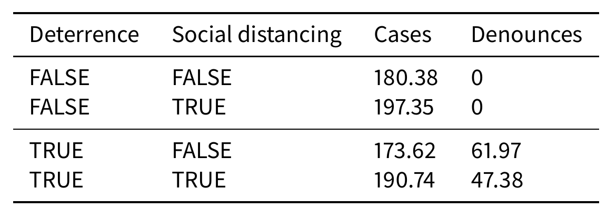
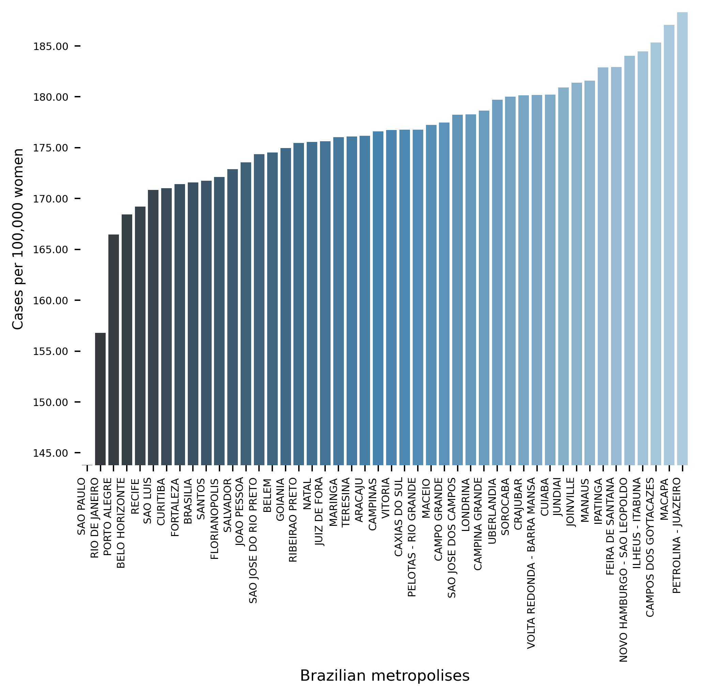
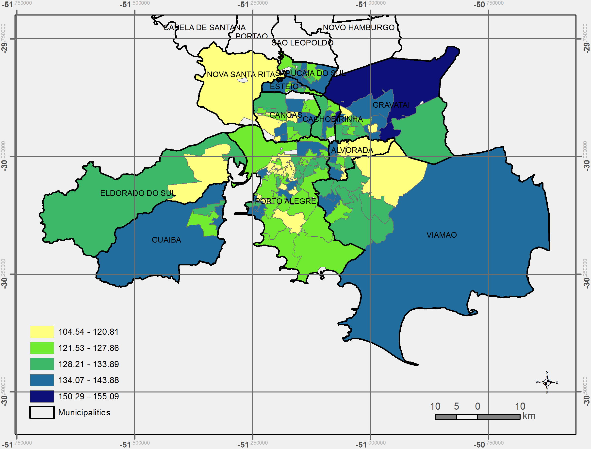
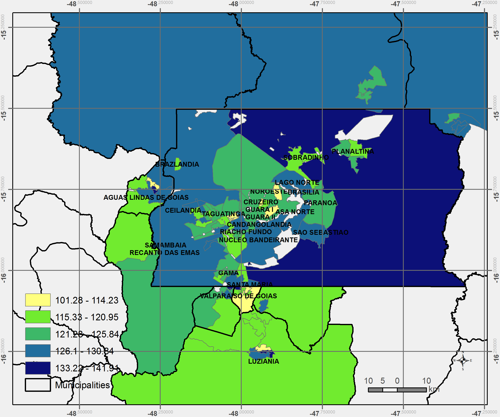

# VIDA: A simulation model of domestic VIolence in times of social DistAncing

### Published at JASSS

###  https://www.jasss.org/24/4/1.html

**Abstract**: Violence against women occurs predominantly in the family and domestic context. The COVID-19 pandemic has led Brazil to recommend and at times, impose social distancing, with the partial closure of economic activities, schools, and restrictions on events and public services. Preliminary evidence shows that intense coexistence increases domestic violence, while social distancing measures may have prevented access to public services and networks, information, and help. We propose an agent-based model (ABM), called VIDA, to formalize and illustrate a multitude of factors that influence events which could trigger violence. A central part of the model is the construction of a stress indicator, created as a probability trigger of domestic violence occurring within the family environment. Having a formal model that replicates observed patterns of violence based on internal familial characteristics enables us to experiment with altering dynamics. We first tested the (a) absence or presence of the deterrence system of domestic violence against women and then (b) the existence of measures to increase social distancing. VIDA presents comparative results for metropolitan regions and neighborhoods considered in the experiments. Results suggest that social distancing measures, particularly those encouraging staying at home, may have increased domestic violence against women by about 10%. VIDA suggests further that more populated areas have comparatively fewer cases per hundred thousand women than less populous capitals or rural areas of urban concentrations. This paper contributes to the literature by formalizing, to the best of our knowledge, the first model of domestic violence through agent-based modeling, using empirical detailed socioeconomic, demographic, educational, gender, and race data at the intraurban (census sectors) and household level. 

## Results

Figure 1: Experimental design: deterrence system and social distancing

Figure 2: Comparison among Brazilian metropolitan regions

Figure 3: Intrametropolitan comparison (Porto Alegre - RS)

Figure 4: Intrametropolitan comparison (Brasília - DF)

# VIDA: Simulando VIolência DomésticA em Tempos de Quarentena

Discusstion paper 2633 in Portuguese

Lígia Mori Madeira
Bernardo Alves Furtado (code)
Alan Dill

https://www.ipea.gov.br/portal/index.php?option=com_content&view=article&id=37625&Itemid=457

"Traditionally, researchers have employed statistical methods to model crime. However, these approaches
are limited by being unable to model individual actions and behaviour. ... [a model should] attempt to model
the occurrence of crimes and motivations behind it. ... **explore the potential of the model to realistically
simulate the main processes and drivers within this system**." (Malleson, Heppenstall, See, 2009).  

We developed the model on top of [https://github.com/projectmesa/mesa] mesa.
We thank Jackie Kazil, David Massa and all the contributors of the mesa project. 

# [Projeto VIDA (vídeo explicativo)](https://www.youtube.com/watch?v=14r831iPbbM&feature=youtu.be])  

## Objetivos

1. Ilustrar –- por meio de um **Modelo Baseado em Agentes** -– situações de violência doméstica
antes e depois da pandemia, reproduzindo os principais achados da literatura

2. Contribuir com o entendimento dos fatores preponderantes e a adequação de medidas
de dissuasão

3. ... empiricamente considerando as
diversidades das RMs brasileiras.

# To run the model:
## Instalação

### Windows

1. Preferencialmente, download e instale Python, via [https://www.anaconda.com/distribution] conda. 
No mínimo, tenha Python 3 instalado
2. Preferencialmente, download e instale uma IDE. Sugiro 
[https://www.jetbrains.com/pycharm/download/] PyCharm Community. 
Universitários tem acesso à versão profissional, basta cadastro com e-mail institucional. 
3. Donwload e instale [https://git-scm.com/downloads] [GIT].
4. Com todos funcionando, vá até o Terminal do PyCharm (ou command line com acesso a Python) e usando o Git, 
clone esse repositório:
    1. `git clone https://github.com/BAFurtado/VIDA_home_violence.git`  
    2. `conda install mesa`

### Linux

1. Python3 e o pip (gerenciador de módulos) são nativos da instalação na maioria das distribuições.
2. Utilize o comando `sudo apt-get install git` (No Ubuntu ou outras distros baseadas em Debian), `sudo dnf install git` (Fedora), para instalar o Git em sua máquina.
3. Utilize o comando `pip install mesa` para instalar o mesa. Utilize o comando `pip freeze | grep -i 'mesa=='` e certifique-se que a versão do mesa seja >= 2.2.4
4. Clone o repositório: `git clone https://github.com/BAFurtado/VIDA_home_violence.git`.

## Instruções para a execução do modelo

1. Para executar o generalization_aps (várias regiões metropolitanas), utilize o comando: 

* `python "violence/generalization_aps.py"`

Enjoy modeling!