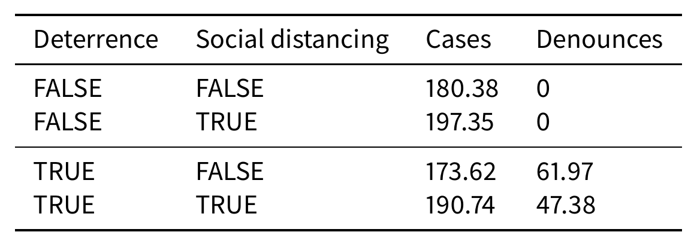
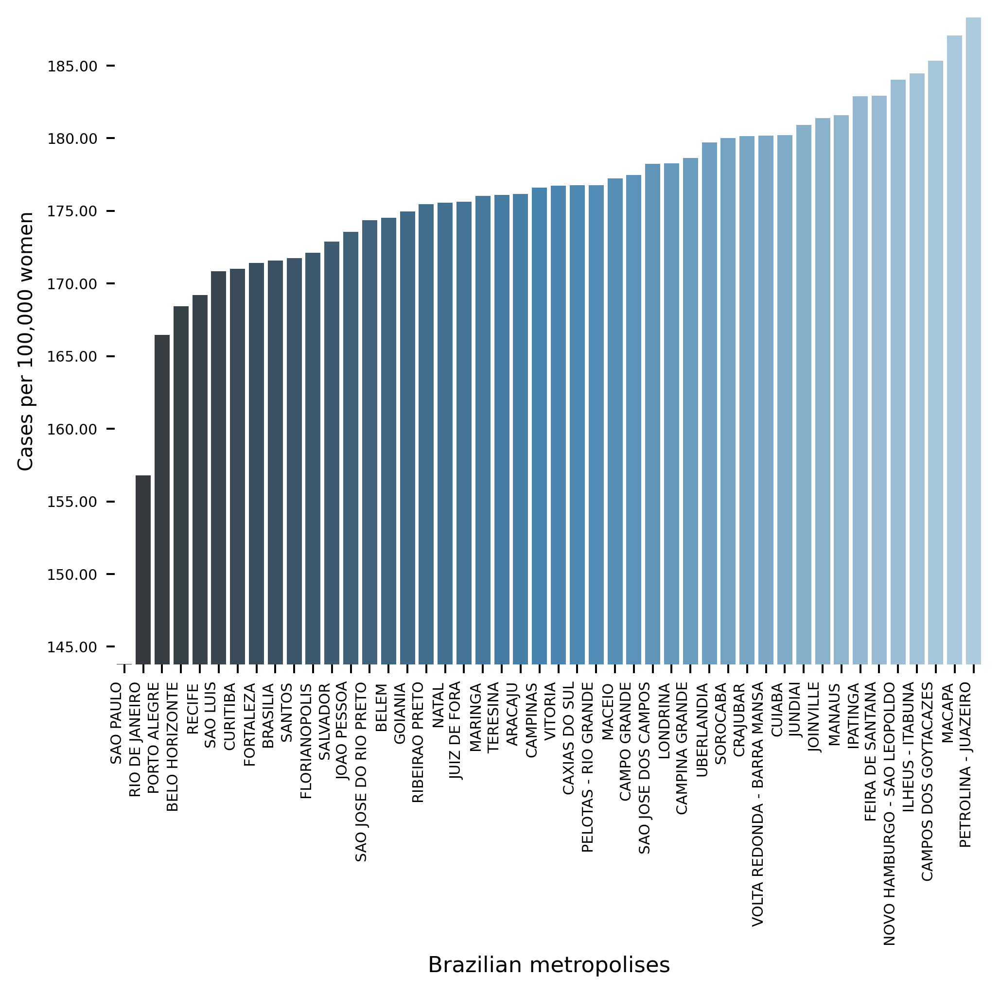
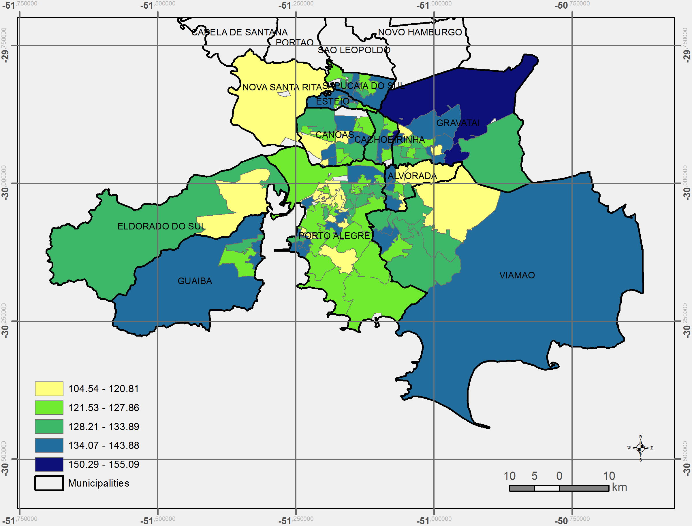
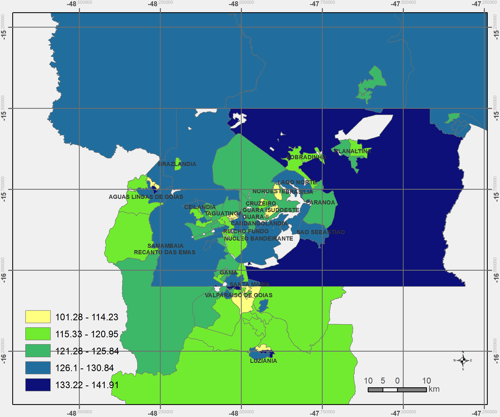

# VIDA: A simulation model of domestic VIolence in times of social DistAncing

[submitted and available at arXiv]

**Abstract**: Violence against women occurs predominantly in the family and domestic context. The COVID-19
pandemic led Brazil to recommend and, at times, impose social distancing, with the partial closure of economic
activities, schools, and restrictions on events and public services. Preliminary evidence shows that intense co-
existence increases domestic violence, while social distancing measures may have prevented access to public
services and networks, information, and help. We propose an agent-based model (ABM), called VIDA, to illus-
trate and examine multi-causal factors that influence events that generate violence. A central part of the model
is the multi-causal stress indicator, created as a probability trigger of domestic violence occurring within the
family environment. Two experimental design tests were performed: (a) absence or presence of the deterrence
system of domestic violence against women and measures to increase social distancing. VIDA presents com-
parative results for metropolitan regions and neighbourhoods considered in the experiments. Results suggest
that social distancing measures, particularly those encouraging staying at home, may have increased domestic
violence against women by about 10%. VIDA suggests further that more populated areas have comparatively
fewer cases per hundred thousand women than less populous capitals or rural areas of urban concentrations.
This paper contributes to the literature by formalising, to the best of our knowledge, the first model of domestic
violence through agent-based modelling, using empirical detailed socioeconomic, demographic, educational,
gender, and race data at the intraurban level (census sectors).

## Results

# VIDA: Simulando VIolência DomésticA em Tempos de Quarentena
(in press at Ipea Editorial -- Discussion Paper)

**anonymized during review**

"Traditionally, researchers have employed statistical methods to model crime. However, these approaches
are limited by being unable to model individual actions and behaviour. ... [a model should] attempt to model
the occurrence of crimes and motivations behind it. ... **explore the potential of the model to realistically
simulate the main processes and drivers within this system**." (Malleson, Heppenstall, See, 2009).  

We developed the model on top of [https://github.com/projectmesa/mesa] mesa.
We thank Jackie Kazil, David Massa and all the contributors of the mesa project. 

# [VIDA video explicativo -- 4 minutos](https://www.youtube.com/watch?v=14r831iPbbM&feature=youtu.be])  

## Objetivos

1. Ilustrar –- por meio de um **Modelo Baseado em Agentes** -– situações de violência doméstica
antes e depois da pandemia, reproduzindo os principais achados da literatura

2. Contribuir com o entendimento dos fatores preponderantes e a adequação de medidas
de dissuasão

3. ... empiricamente considerando as
diversidades das RMs brasileiras.

# To run the model:
## Instalação inicial

1. Preferencialmente, download e instale Python, via [https://www.anaconda.com/distribution] conda. 
No mínimo, tenha Pyton3 instalado
2. Preferencialmente, download e instale uma IDE. Sugiro 
[https://www.jetbrains.com/pycharm/download/] PyCharm Community. 
Universitários tem acesso à versão profissional, basta cadastro com e-mail institucional. 
3. Donwload e instale [https://git-scm.com/downloads] [GIT].
4. Com todos funcionando, vá até o Terminal do PyCharm (ou command line com acesso a Python) e usando o Git, 
clone esse repositório:
    1. `git clone https://github.com/BAFurtado/home_violence.git`  
    2. `pip install mesa`
    
## Para rodar o modelo
5. Utilize o comando `cd` para que o Terminal esteja no diretorio correto: 
    1. `cd home_violence`
    2. Type `mesa runserver` e pronto. Se tudo foi instalado, o browser se abrirá automaticamente. 
    3. Altere os parâmetros como quiser.
    4. Clique em `Reset` no último botão à direita, na barra preta ao alto.
    5. Clique em `Start`, à esquerda do `Reset'
    
Enjoy modeling!
